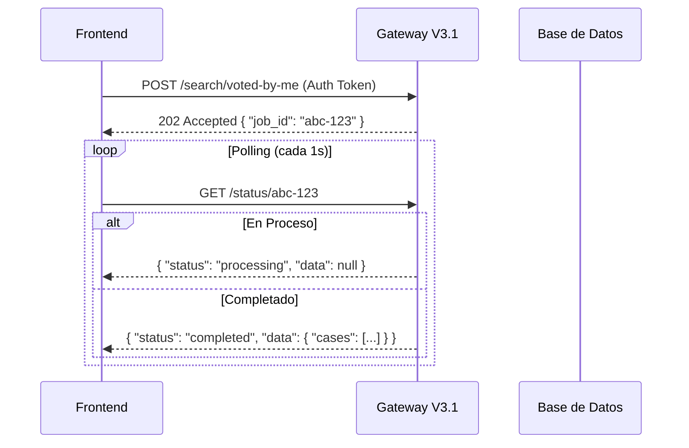

---

### Archivo 1: Especificación OpenAPI 3.0 (Detallada)

Este archivo incluye ejemplos reales extraídos de los datos que proporcionaste (Sismo en Santander, Ley de Salud Mental, etc.).

```json
{
  "openapi": "3.0.3",
  "info": {
    "title": "Digitalia Search Gateway - Macro Endpoints (V3.1)",
    "description": "API Gateway optimizado para el ecosistema Digitalia. Esta versión V3.1 introduce 'Macro Endpoints' dedicados para escenarios de negocio específicos, eliminando la necesidad de construir payloads complejos en el cliente. Soporta búsqueda híbrida (texto + filtros SQL + JSONB profundo).\n\n### Patrón de Diseño: Job Asíncrono\nCasi todas las operaciones de búsqueda son asíncronas para garantizar el rendimiento con grandes volúmenes de datos:\n1.  **POST** a un endpoint de búsqueda -> Recibe `job_id`.\n2.  **GET /status/{job_id}** -> Polling hasta recibir `completed`.\n\n### Autenticación\nRequiere header `Authorization: Bearer <JWT>` de Supabase.",
    "version": "3.1.0",
    "contact": {
      "name": "Equipo Digitalia Backend",
      "email": "dev@digitalia.gov.co"
    }
  },
  "servers": [
    {
      "url": "https://mdkswlgcqsmgfmcuorxq.supabase.co/functions/v1/search-dto-macros",
      "description": "Entorno de Producción (Supabase Edge Functions)"
    }
  ],
  "security": [
    {
      "bearerAuth": []
    }
  ],
  "paths": {
    "/lookup": {
      "post": {
        "tags": ["Operaciones Síncronas"],
        "summary": "Buscar Caso Específico (Síncrono)",
        "description": "Recupera un caso individual inmediatamente. Ideal para vistas de detalle cuando ya se tiene un enlace o ID. Busca por UUID (Documento, Caso, StandardizedCase) o por URL exacta.",
        "operationId": "lookupCase",
        "requestBody": {
          "required": true,
          "content": {
            "application/json": {
              "schema": {
                "type": "object",
                "required": ["identifier"],
                "properties": {
                  "identifier": {
                    "type": "string",
                    "description": "UUID o URL completa del recurso.",
                    "example": "https://www.eltiempo.com/colombia/santander/temblor-hoy-en-colombia-reportan-sismo-en-santander-en-la-madrugada-de-este-viernes-16-de-enero-magnitud-epicentro-y-detalles-3524625"
                  },
                  "select_fields": {
                    "type": "array",
                    "items": { "type": "string" },
                    "description": "Lista opcional de campos para reducir la respuesta.",
                    "example": ["id", "overview.title", "overview.verdict_label"]
                  }
                }
              }
            }
          }
        },
        "responses": {
          "200": {
            "description": "Caso encontrado.",
            "content": {
              "application/json": {
                "schema": {
                  "type": "object",
                  "properties": {
                    "case": { "$ref": "#/components/schemas/StandardizedCase" }
                  }
                },
                "example": {
                  "case": {
                    "id": "e398aa40-ee1e-4bb9-8224-3b3940d5ded9",
                    "overview": {
                      "title": "Temblor hoy en Colombia | Reportan sismo de magnitud 5.0 en Santander...",
                      "verdict_label": "Desarrolla las premisas AMI",
                      "source_domain": "eltiempo.com"
                    }
                  }
                }
              }
            }
          },
          "404": { "description": "No encontrado." }
        }
      }
    },
    "/search/all": {
      "post": {
        "tags": ["Macros de Búsqueda (Asíncronos)"],
        "summary": "Feed General (Macro)",
        "description": "Inicia un trabajo para obtener todos los casos ordenados cronológicamente (feed principal). Equivalente a `filter_mode: 'all'`.",
        "operationId": "macroAllCases",
        "requestBody": {
          "content": {
            "application/json": {
              "schema": { "$ref": "#/components/schemas/BasePaginationRequest" }
            }
          }
        },
        "responses": {
          "202": { "$ref": "#/components/responses/JobAccepted" }
        }
      }
    },
    "/search/voted-by-me": {
      "post": {
        "tags": ["Macros de Búsqueda (Asíncronos)"],
        "summary": "Mis Votos (Macro)",
        "description": "Filtra casos donde el usuario autenticado (extraído del JWT) ya ha emitido un voto. Útil para 'Historial de Actividad'.",
        "operationId": "macroVotedByMe",
        "requestBody": {
          "content": {
            "application/json": {
              "schema": { "$ref": "#/components/schemas/BasePaginationRequest" }
            }
          }
        },
        "responses": {
          "202": { "$ref": "#/components/responses/JobAccepted" }
        }
      }
    },
    "/search/not-voted-by-me": {
      "post": {
        "tags": ["Macros de Búsqueda (Asíncronos)"],
        "summary": "Pendientes por Votar (Macro)",
        "description": "Filtra casos donde el usuario NO ha votado. Incluye documentos nuevos sin procesar (case_id null) y casos existentes sin mi voto. Base para la 'Cola de Trabajo'.",
        "operationId": "macroNotVotedByMe",
        "requestBody": {
          "content": {
            "application/json": {
              "schema": { "$ref": "#/components/schemas/BasePaginationRequest" }
            }
          }
        },
        "responses": {
          "202": { "$ref": "#/components/responses/JobAccepted" }
        }
      }
    },
    "/search/consensus": {
      "post": {
        "tags": ["Macros de Búsqueda (Asíncronos)"],
        "summary": "Con Consenso (Macro)",
        "description": "Filtra casos que tienen al menos 1 voto de cualquier usuario. Separa contenido 'Solo IA' de contenido 'Revisado por Humanos'.",
        "operationId": "macroConsensus",
        "requestBody": {
          "content": {
            "application/json": {
              "schema": { "$ref": "#/components/schemas/BasePaginationRequest" }
            }
          }
        },
        "responses": {
          "202": { "$ref": "#/components/responses/JobAccepted" }
        }
      }
    },
    "/search/query": {
      "post": {
        "tags": ["Macros de Búsqueda (Asíncronos)"],
        "summary": "Búsqueda de Texto (Macro)",
        "description": "Realiza una búsqueda semántica/texto completo en el campo `fts` de la base de datos.",
        "operationId": "macroTextSearch",
        "requestBody": {
          "required": true,
          "content": {
            "application/json": {
              "schema": {
                "allOf": [
                  { "$ref": "#/components/schemas/BasePaginationRequest" },
                  {
                    "type": "object",
                    "required": ["query"],
                    "properties": {
                      "query": { "type": "string", "example": "sismo santander alerta" }
                    }
                  }
                ]
              }
            }
          }
        },
        "responses": {
          "202": { "$ref": "#/components/responses/JobAccepted" }
        }
      }
    },
    "/search/metadata": {
      "post": {
        "tags": ["Macros de Búsqueda (Asíncronos)"],
        "summary": "Filtro por Metadatos (Macro)",
        "description": "Filtra por coincidencias exactas en el nivel superior de la columna JSONB `metadata`.",
        "operationId": "macroMetadata",
        "requestBody": {
          "required": true,
          "content": {
            "application/json": {
              "schema": {
                "allOf": [
                  { "$ref": "#/components/schemas/BasePaginationRequest" },
                  {
                    "type": "object",
                    "required": ["filters"],
                    "properties": {
                      "filters": {
                        "type": "object",
                        "description": "Objeto clave-valor para coincidencia exacta.",
                        "example": { "submission_type": "text", "is_text_analysis": true }
                      }
                    }
                  }
                ]
              }
            }
          }
        },
        "responses": {
          "202": { "$ref": "#/components/responses/JobAccepted" }
        }
      }
    },
    "/search/inner": {
      "post": {
        "tags": ["Macros de Búsqueda (Asíncronos)"],
        "summary": "Búsqueda Profunda JSONB (Macro)",
        "description": "Permite buscar dentro de objetos anidados en la columna `metadata`. Usa el operador de contención de Postgres (@>).",
        "operationId": "macroInnerSearch",
        "requestBody": {
          "required": true,
          "content": {
            "application/json": {
              "schema": {
                "allOf": [
                  { "$ref": "#/components/schemas/BasePaginationRequest" },
                  {
                    "type": "object",
                    "required": ["search_object"],
                    "properties": {
                      "search_object": {
                        "type": "object",
                        "description": "Estructura parcial del objeto JSON que se desea encontrar.",
                        "example": { 
                          "standardized_case": { 
                            "overview": { "verdict_label": "Desarrolla las premisas AMI" } 
                          } 
                        }
                      }
                    }
                  }
                ]
              }
            }
          }
        },
        "responses": {
          "202": { "$ref": "#/components/responses/JobAccepted" }
        }
      }
    },
    "/status/{jobId}": {
      "get": {
        "tags": ["Gestión de Trabajos"],
        "summary": "Consultar Estado del Trabajo",
        "description": "Endpoint de Polling. Devuelve el estado actual y, si terminó, los datos.",
        "parameters": [
          {
            "name": "jobId",
            "in": "path",
            "required": true,
            "schema": { "type": "string", "format": "uuid" }
          }
        ],
        "responses": {
          "200": {
            "description": "Estado del trabajo.",
            "content": {
              "application/json": {
                "schema": {
                  "type": "object",
                  "properties": {
                    "job_id": { "type": "string", "format": "uuid" },
                    "status": { 
                      "type": "string", 
                      "enum": ["processing", "completed", "failed"],
                      "description": "Si es 'processing', volver a intentar en 1-2s."
                    },
                    "data": { "$ref": "#/components/schemas/SearchResult" }
                  }
                }
              }
            }
          },
          "404": { "description": "Trabajo no encontrado (ID inválido o expirado)." }
        }
      }
    }
  },
  "components": {
    "schemas": {
      "BasePaginationRequest": {
        "type": "object",
        "properties": {
          "page": { "type": "integer", "default": 1, "minimum": 1 },
          "pageSize": { "type": "integer", "default": 10, "maximum": 100 },
          "select_fields": {
            "type": "array",
            "items": { "type": "string" },
            "description": "Proyección de campos para optimizar ancho de banda.",
            "example": ["id", "overview", "community.votes"]
          }
        }
      },
      "SearchResult": {
        "type": "object",
        "nullable": true,
        "properties": {
          "cases": {
            "type": "array",
            "items": { "$ref": "#/components/schemas/StandardizedCase" }
          },
          "pagination": {
            "type": "object",
            "properties": {
              "page": { "type": "integer" },
              "pageSize": { "type": "integer" },
              "returnedCount": { "type": "integer" },
              "hasMore": { "type": "boolean" }
            }
          }
        }
      },
      "StandardizedCase": {
        "type": "object",
        "description": "DTO principal hidratado desde 'documents_vectors', 'cases' y 'metadata'.",
        "properties": {
          "id": { "type": "string", "format": "uuid" },
          "created_at": { "type": "string", "format": "date-time" },
          "type": { "type": "string", "enum": ["text", "image", "video"] },
          "lifecycle": {
            "type": "object",
            "properties": {
              "job_status": { "type": "string", "example": "completed" },
              "custody_status": { "type": "string", "example": "ai_processed" },
              "last_update": { "type": "string", "format": "date-time" }
            }
          },
          "overview": {
            "type": "object",
            "properties": {
              "title": { "type": "string" },
              "summary": { "type": "string" },
              "verdict_label": { "type": "string", "example": "Desarrolla las premisas AMI" },
              "risk_score": { "type": "number", "example": 89.5 },
              "source_domain": { "type": "string", "example": "noticiasrcn.com" },
              "main_asset_url": { "type": "string", "nullable": true }
            }
          },
          "insights": {
            "type": "array",
            "items": {
              "type": "object",
              "properties": {
                "id": { "type": "string" },
                "label": { "type": "string" },
                "value": { "type": "string" },
                "category": { "type": "string" },
                "description": { "type": "string" }
              }
            }
          },
          "community": {
            "type": "object",
            "properties": {
              "votes": { "type": "integer", "description": "Total de votos recibidos" },
              "status": { "type": "string", "enum": ["ai_only", "human_consensus"] },
              "breakdown": {
                "type": "object",
                "additionalProperties": { "type": "integer" },
                "description": "Conteo de votos por etiqueta",
                "example": { "Cumple": 5, "No Cumple": 2 }
              }
            }
          },
          "reporter": {
            "type": "object",
            "nullable": true,
            "properties": {
              "id": { "type": "string" },
              "name": { "type": "string" },
              "reputation": { "type": "number" }
            }
          }
        },
        "example": {
          "id": "e46754ca-cc3e-4aed-a617-8c4da9e90608",
          "created_at": "2026-01-16T17:42:52.517Z",
          "type": "text",
          "lifecycle": {
            "job_status": "completed",
            "custody_status": "ai_processed",
            "last_update": "2026-01-16T17:42:52.517Z"
          },
          "overview": {
            "title": "Seis meses después de la Nueva Ley de Salud Mental: ¿y ahora quién responde?",
            "summary": "Opinión por Gloria Díaz sobre la implementación de la ley 2460...",
            "verdict_label": "Requiere un enfoque AMI",
            "risk_score": 0,
            "source_domain": "noticiasrcn.com"
          },
          "community": {
            "votes": 1,
            "status": "human_consensus",
            "breakdown": { "Requiere un enfoque AMI": 1 }
          },
          "reporter": {
             "id": "125d4b66-fca7-40d2-a1ef-90334302b303",
             "name": "Juan Perez",
             "reputation": 150
          }
        }
      }
    },
    "responses": {
      "JobAccepted": {
        "description": "Trabajo aceptado. Se inició el proceso en segundo plano.",
        "content": {
          "application/json": {
            "schema": {
              "type": "object",
              "properties": {
                "job_id": { "type": "string", "format": "uuid", "example": "a1b2c3d4-e5f6-7890-1234-567890abcdef" }
              }
            }
          }
        }
      }
    },
    "securitySchemes": {
      "bearerAuth": {
        "type": "http",
        "scheme": "bearer",
        "bearerFormat": "JWT"
      }
    }
  }
}
```

---

### Archivo 2: Guía de Implementación Frontend (Markdown)

Esta guía explica conceptualmente cómo consumir la API y proporciona código listo para usar.

---
# Guía de Implementación Frontend: Digitalia Search Gateway V3.1

Esta guía detalla cómo integrar el nuevo sistema de "Macro Endpoints" en la aplicación cliente (React, Vue, Angular, etc.). La versión 3.1 simplifica la lógica del lado del cliente proporcionando rutas dedicadas para cada caso de uso.

## 1. Concepto: El Patrón de Búsqueda Asíncrona

Debido a la complejidad de filtrar y procesar metadatos JSONB masivos, la búsqueda opera en dos pasos para no bloquear la interfaz de usuario:

1.  **Dispatch (Envío):** El frontend solicita una búsqueda (ej: "Mis votos"). El servidor responde *inmediatamente* con un `job_id` y código 202.
2.  **Polling (Consulta):** El frontend consulta cada X segundos el estado de ese trabajo hasta que esté `completed`.



## 2. Historias de Usuario y Endpoints Correspondientes

Aquí se describe qué endpoint usar para cada funcionalidad de la interfaz.

### Historia A: "Ver mi Feed Principal"
**Como** usuario, **quiero** ver las últimas noticias y casos procesados por la plataforma.
*   **Endpoint:** `/search/all`
*   **Uso:** Carga inicial de la aplicación. Muestra todo el contenido cronológicamente.

### Historia B: "Ver mi Cola de Trabajo (Pendientes)"
**Como** analista, **quiero** ver solo los casos en los que **yo no he votado**, para saber en qué trabajar.
*   **Endpoint:** `/search/not-voted-by-me`
*   **Lógica Backend:** Excluye automáticamente los IDs presentes en la tabla `votes` vinculados a mi `user_id`. Incluye documentos nuevos que aún no son casos formales.

### Historia C: "Ver mi Historial de Actividad"
**Como** analista, **quiero** revisar los casos que ya evalué anteriormente.
*   **Endpoint:** `/search/voted-by-me`
*   **Lógica Backend:** Hace un `INNER JOIN` con mis votos.

### Historia D: "Buscar Noticias sobre un Tema"
**Como** investigador, **quiero** escribir "sismo santander" y ver resultados relevantes.
*   **Endpoint:** `/search/query`
*   **Param:** `query: "sismo santander"`
*   **Nota:** Usa búsqueda Full Text Search (FTS) en Postgres.

### Historia E: "Filtrar por Veredicto AMI"
**Como** usuario, **quiero** ver solo los casos clasificados como "Engañoso" o "Sátira".
*   **Endpoint:** `/search/inner` (Búsqueda Profunda)
*   **Caso de uso:** Filtros avanzados en la barra lateral.
*   **Payload:** 
    ```json
    {
      "search_object": { 
        "standardized_case": { "overview": { "verdict_label": "Sátira" } } 
      }
    }
    ```

## 3. Snippets de Código (Implementación de Referencia)

Se recomienda crear una clase o servicio `SearchService` que abstraiga el proceso de polling.

### Paso 1: Servicio Genérico de Polling

```typescript
// services/searchClient.ts

const BASE_URL = 'https://mdkswlgcqsmgfmcuorxq.supabase.co/functions/v1/search-dto-macros';

async function runSearchJob(endpoint: string, payload: any, token: string) {
  // 1. Iniciar el trabajo
  const startRes = await fetch(`${BASE_URL}${endpoint}`, {
    method: 'POST',
    headers: {
      'Authorization': `Bearer ${token}`,
      'Content-Type': 'application/json'
    },
    body: JSON.stringify(payload)
  });

  if (!startRes.ok) throw new Error('Error iniciando búsqueda');
  const { job_id } = await startRes.json();

  // 2. Polling hasta completar
  let attempts = 0;
  const maxAttempts = 20; // 20 segundos timeout

  while (attempts < maxAttempts) {
    const statusRes = await fetch(`${BASE_URL}/status/${job_id}`, {
      headers: { 'Authorization': `Bearer ${token}` }
    });
    
    if (statusRes.status === 404) throw new Error('Trabajo perdido');
    
    const body = await statusRes.json();
    
    if (body.status === 'completed') {
      return body.data; // Retorna { cases: [], pagination: {} }
    }
    
    if (body.status === 'failed') {
      throw new Error(body.data?.error || 'Error desconocido en el servidor');
    }

    // Esperar 1 segundo antes del siguiente intento
    await new Promise(r => setTimeout(r, 1000));
    attempts++;
  }
  
  throw new Error('Timeout de búsqueda');
}
```

### Paso 2: Métodos de Negocio (Macros)

```typescript
// services/DigitaliaSearch.ts

export const DigitaliaSearch = {
  
  // Feed Principal
  getFeed: (token: string, page = 1) => 
    runSearchJob('/search/all', { page, pageSize: 10 }, token),

  // Cola de Trabajo (Lo más importante para analistas)
  getPendingWork: (token: string, page = 1) => 
    runSearchJob('/search/not-voted-by-me', { page, pageSize: 10 }, token),

  // Historial Personal
  getMyHistory: (token: string, page = 1) => 
    runSearchJob('/search/voted-by-me', { page, pageSize: 20 }, token),

  // Búsqueda de Texto
  searchByText: (token: string, query: string, page = 1) => 
    runSearchJob('/search/query', { query, page }, token),

  // Ejemplo de Filtro Avanzado: Solo artículos de opinión
  getOpinions: (token: string, page = 1) => 
    runSearchJob('/search/inner', { 
      page,
      search_object: { 
        "standardized_case": { 
            "overview": { "verdict_label": "Opinión" } 
        } 
      } 
    }, token)
};
```

### Paso 3: Uso en un Componente (React Example)

```tsx
import { useState, useEffect } from 'react';
import { DigitaliaSearch } from './services/DigitaliaSearch';
import { useAuth } from './hooks/useAuth'; // Tu hook de auth

export const PendingWorkList = () => {
  const { token } = useAuth();
  const [cases, setCases] = useState([]);
  const [loading, setLoading] = useState(false);

  useEffect(() => {
    if (!token) return;

    const loadData = async () => {
      setLoading(true);
      try {
        // Llamada simplificada gracias a los Macros V3.1
        const result = await DigitaliaSearch.getPendingWork(token);
        setCases(result.cases);
      } catch (err) {
        console.error("Error cargando cola de trabajo:", err);
      } finally {
        setLoading(false);
      }
    };

    loadData();
  }, [token]);

  if (loading) return <div>Cargando y procesando datos...</div>;

  return (
    <div className="feed">
      <h1>Casos Pendientes de tu Voto</h1>
      {cases.map(c => (
        <Card key={c.id} title={c.overview.title} summary={c.overview.summary} />
      ))}
    </div>
  );
};
```

## 4. Detalles de los Objetos de Respuesta (DTO)

El Gateway normaliza la base de datos a un objeto estándar llamado `StandardizedCase`. Los desarrolladores de Frontend deben mapear contra esta estructura.

**Ejemplo de Mapeo (Campos Clave):**

| Campo UI | Ruta en JSON Respuesta | Descripción |
| :--- | :--- | :--- |
| **Título** | `case.overview.title` | Título del artículo o caso. |
| **Resumen** | `case.overview.summary` | Resumen generado por IA o extraído. |
| **Veredicto** | `case.overview.verdict_label` | Ej: "Desarrolla las premisas AMI", "Sátira". |
| **Riesgo** | `case.overview.risk_score` | Número 0-100. Útil para barras de colores. |
| **Estado Comunidad** | `case.community.status` | `ai_only` (Gris) o `human_consensus` (Verde). |
| **Mis Votos** | (Implícito) | Si usas `/search/voted-by-me`, el usuario actual votó aquí. |
| **Fuente** | `case.overview.source_domain` | Dominio (ej: eltiempo.com). |

## 5. Manejo de Errores Comunes

1.  **401 Unauthorized:** El token JWT ha expirado o no se envió. Redirigir a Login.
2.  **Job Stuck (Processing infinito):** Si el endpoint `/status` devuelve `processing` por más de 10-15 segundos, implementa un timeout en el cliente y muestra "El servidor está ocupado, reintentar".
3.  **Resultados Vacíos (`cases: []`):**
    *   En `/search/voted-by-me`: El usuario es nuevo y no ha votado nada.
    *   En `/search/not-voted-by-me`: ¡Felicidades! El usuario está al día (Inbox Zero).